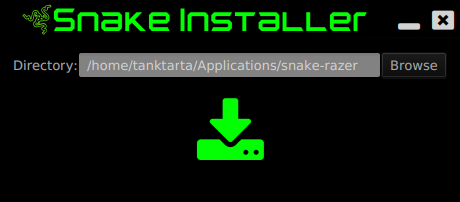
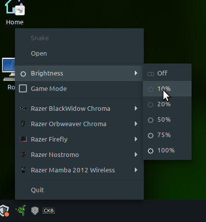

# WARNING 

* I am in the final phases of the first release, hopefully to be complete before the weekend of 17th Octobober is over.  The installers aren't quite ready yet, but the brave are welcome to checkout the source and try it out now. *

#Snake


Snake is application to control and configure your Razer devices on Linux. Making use of the awesome OpenRazer drivers, *Snake* provides access to most features the drivers provides.

 * Stylised user interface with animations and effects
 * Simple installation, and self updating.
 * Supports all devices supported by OpenRazer.
 * Supports multiple concurrent devices.
 * Set and configure Razer effects such as Breath, Wave, Static and more.
 * Control over individual LEDs using the Matrix feature.  *(incomplete)*
 * Battery status.
 * Integrated System Tray icon (or indicator).  *(incomplete)*
 * Global brightness controls the brightness of all devices at once.
 * Macro support. *(incomplete)*
 * Themes *(coming soon)*
 
## Install

There are several different ways to run Snake. In all cases, the first time the app runs you will be asked if you want to create a desktop shortcut (i.e. menu entry).

 

**All binary versions of Snake are built for 64 bit x86 only. For 32 bit, or other architectures, please use one of the "No-Runtime" packages below.**

### Self Extracting Installer

The self extracting installer is the easiest to use. You will be asked for a location to install Snake. It will then update to the latest version and start up.

#### From The Command Line

```
wget http://github.io/brett-smith/snake/downloads/snake-installer.sh
sh snake-installer.sh &
```

#### From Your Desktop

 *  Download [snake-installer.sh](http://github.io/brett-smith/snake/downloads/snake-installer.sh).
 *  Add Execute permission to the downloaded *snake-installer.sh* in your file manager.
 *  Use the Open action in your file manager to start the installer.

### Application Archive

Another option is to download the archived version of the app, extract it to where you want to install, and just run it.

#### From The Command Line

```
wget http://github.io/brett-smith/snake/downloads/snake.tgz
tar xzf snake.tgz
cd snake
bin/snake &
```

#### From Your Desktop

 *  Download [snake.tgz](http://github.io/brett-smith/snake/downloads/snake.tgz) and extract it to an empty folder on your computer.
 *  Use the Open action in your file manager to locate and start `bin/snake` in the extracted folder.
 
### No-Runtime Packages

The above packages all include a stripped down X86_64 Java runtime so you do not need to install your own. If you  have another architecture such as X86 or Arm, or just want a smaller download, you can use your own runtime. It just needs to be at least [Java 15](https://adoptopenjdk.net/). 

 * [Tar Archive](http://github.io/brett-smith/snake/downloads/snake-no-runtime.tgz)
 * [Zip Archive](http://github.io/brett-smith/snake/downloads/snake-no-runtime.zip)
 
All these packages include the `bin/snake` launcher script. You may need to edit this if you want to use a runtime other than the system default.
 
### OS Packages

There are many packaging formats for Linux, so I will only be providing a few common ones. 

 * [Generic X86_64 DEB package](http://github.io/brett-smith/snake/downloads/snake.deb)
 * [Generic X86_64 RPM package](http://github.io/brett-smith/snake/downloads/snake.deb)
 
Install according to your distributions instructions. Usually it should just be a case of clicking on the downloaded file. 

** I do not currently provide repositories for these packages, and they do not support the automatic updating that the other generic packages do.**

## Updating

All installations of Snake are self updating, unless you are using our own OS specific packages. Those provided by a 3rd party repository may provide updates.

Update options may be found may be found in the ** Options** screen.

### Automatic Updates

By default, Snake will update automatically and you should never need to touch it. If you prefer though, you can turn this off and you will be notified when updates are available. The update may then be installed on demand. 

### Beta Updates

You can optionally accept beta updates. While I will strive to keep the beta channel stable, these may contain as-yet untested features, and some behaviour may be unexpected. You can at any time revert to the release  channel.

When changing this option, *Snake* will restart after 2 seconds and download appropriate version.
 
## Build From Source

To build Snake from source you need :-

 * Git
 * Java 15+
 * Apache Maven

Other dependencies are downloaded by Maven during the build process.

Further dependencies may be needed for building deployable packages.

### Build

```
git clone https://github.com/brett-smith/snake.git
cd snake
mvn clean package
```

If the build completes OK, you can then run or install Snake.

### Run

Once build, you can run directly.

```
TODO
```

### Install

Or you can install what you have built.

```
snake-dist/target/snake-installer.sh
```

## Options

Configuration is very simple. The backend should take care of the devices, Snake just has a few options for appearance and behaviour.

 

To access options, click the cog icon, ** Options**.

### Appearance

Various options for configuration how Snake looks.

**Colour** - Allows the background colour to be set. Note, this option will be removed in the future and replaced with themes.

**Use Window Manager Decorations** - By default, Snake uses "Client Side Decorations", and draws it's own window title bar and window management buttons (close, min, max). Turn this option off to use window manager decorations instead. In this mode, Options and About are both insteads accessed from icons at the bottom right of the overview screen.

**Transparency** - If you are using client side decorations, then window transparency is possible. This slider sets how transparent the window should be.


### Updates

**Check for updates** - Whether to check for updates at all. When deselected, neither automatic or manual updating is possible.

 **Update automatically** - When selected, Snake will update itself automatically on startup if required. 
 
 **Install beta updates as well** - When selected, you will be able to receive beta updates  that may contain fixes or features that you wish to try out before full release.

### Tray

**Icon  Style** - Different options for how the tray icon appears, if at all.

**Show Battery** - If you have at least one device that has a battery, then the option is given to show the battery status on the system tray instead of the razer logo.

  **When low** - When selected the battery status will only be showing if the overall battery status is *Low*.
  
**Start on login** - If the tray icon is enabled, you probably want to start it when you login. The option allows you to do so. When turned off, the tray icon will appear when you manually start Snake.

## System Tray

The system tray icon runs in the background and provides quick access to common functions of your devices.

 
 
 It can also show a summary of the battery status (when configuration).
