# WARNING 

**No packages are available for download, not will the update system work until the new domain bithatch.co.uk is fully live.**

#Snake


Snake is application to control and configure your Razer devices on Linux. Making use of the awesome OpenRazer drivers, *Snake* provides access to most features the drivers provides.

 * Stylised user interface with animations and effects
 * Simple installation, and self updating.
 * Supports all devices supported by OpenRazer.
 * Supports multiple concurrent devices.
 * Set and configure Razer effects such as Breath, Wave, Static and more.
 * Control over individual LEDs using the Matrix feature.  *(incomplete)*
 * Battery status.
 * Integrated System Tray icon (or indicator)
 * Global brightness controls the brightness of all devices at once.
 * Macro support. *(incomplete, awaiting Driver changes)*
 * Themes
 
## Install

There are several different ways to run Snake. In all cases, the first time the app runs you will be asked if you want to create a desktop shortcut (i.e. menu entry).

 

**All binary versions of Snake are built for 64 bit x86 only. For 32 bit, or other architectures, please use one of the "No-Runtime" packages below.**

### Self Extracting Installer

The self extracting installer is the easiest to use. You will be asked for a location to install Snake. It will then update to the latest version and start up.

#### From The Command Line

```
wget -O snake-installer-amd64.sh \
 http://www.bithatch.co.uk/downloads/snake/snapshot/snake-installer-amd64.sh && \
 sh snake-installer-amd64.sh
```

#### From Your Desktop

 *  Download [snake-amd64-installer.sh](http://www.bithatch.co.uk/downloads/snake/snapshot/snake-installer-amd64.sh).
 *  Add Execute permission to the downloaded *snake-installer.sh* in your file manager.
 *  Use the Open action in your file manager to start the installer.

### Application Archive

Another option is to download the archived version of the app, extract it to where you want to install, and just run it.

#### From The Command Line

```
wget -O snake-amd64.tar.gz \
 http://www.bithatch.co.uk/downloads/snake/snapshot/snake-amd64-tar.gz
tar xzf snake-amd64-tar.gz
cd snake
bin/snake &
```

#### From Your Desktop

 *  Download [snake-amd64.tar.gz](http://www.bithatch.co.uk/downloads/snake/snapshot/snake-amd64-tar.gz) and extract it to an empty folder on your computer.
 *  Use the Open action in your file manager to locate and start `bin/snake` in the extracted folder.
 
### No-Runtime Packages

The above packages all include a stripped down amd64 Java runtime so you do not need to install your own. If you  have another architecture such as X86 or Arm, or just want a smaller download, you can use your own runtime. It just needs to be at least [Java 15](https://adoptopenjdk.net/). 

 * [Installer](http://www.bithatch.co.uk/downloads/snake/snapshot/snake-noruntime-installer.sh)
 * [Tar Archive](http://www.bithatch.co.uk/downloads/snake/snapshot/snake-noruntime.tar.gz)
 
All these packages include the `bin/snake` launcher script. You may need to edit this if you want to use a runtime other than the system default.
 
### OS Packages

There are many packaging formats for Linux, so I will only be providing a few common ones. 

 * [amd64 DEB package](http://www.bithatch.co.uk/downloads/snake/snapshot/snake-amd64.deb)
 * [amd64 RPM package](http://www.bithatch.co.uk/downloads/snake/snapshot/snake-amd64.rpm)
 * [Generic No Runtime DEB package](http://www.bithatch.co.uk/downloads/snake/snapshot/snake-noruntime.deb)
 * [Generic No Runtime RPM package](http://www.bithatch.co.uk/downloads/snake/snapshot/snake-noruntime.noarch.rpm)
 
Install according to your distributions instructions. Usually it should just be a case of clicking on the downloaded file. 

** I do not currently provide repositories for these OS specific packages, but they will mostly auto update in the same way as other packages.**

## Updating

All installations of Snake are self updating, unless you are using our own OS specific packages. Those provided by a 3rd party repository may provide updates.

Update options may be found may be found in the ** Options** screen.

### Automatic Updates

By default, Snake will update automatically and you should never need to touch it. If you prefer though, you can turn this off and you will be notified when updates are available. The update may then be installed on demand. 

### Beta Updates

You can optionally accept beta updates. While I will strive to keep the beta channel stable, these may contain as-yet untested features, and some behaviour may be unexpected. You can at any time revert to the release  channel.

When changing this option, *Snake* will restart after 2 seconds and download appropriate version.
 
## Build From Source

To build Snake from source you need :-

 * Git
 * Java 15+
 * Apache Maven

Other dependencies are downloaded by Maven during the build process.

Further dependencies may be needed for building deployable packages.

### Build

```
git clone https://github.com/brett-smith/snake.git
cd snake
mvn clean install
```

If the build completes OK, you can then run or install Snake.

### Run

Once build, you can run directly.

```
cd snake-app-linux
mvn javafx:run
```

### Install

Or you can install what you have built.

```
snake-dist/target/snake-installer-amd64.sh
```

## Options

Configuration is very simple. The backend should take care of the devices, Snake just has a few options for appearance and behaviour.

 

To access options, click the cog icon, ** Options**.

### Appearance

Various options for configuration how Snake looks.

**Theme** - Allows the look of Snake to be changed. A selection of themes that are colour variations of the default are provided, with more to come. Creating your own will be documented soon, but the adventurous can try by copying any existing theme module and adjusting the contents accordingly.

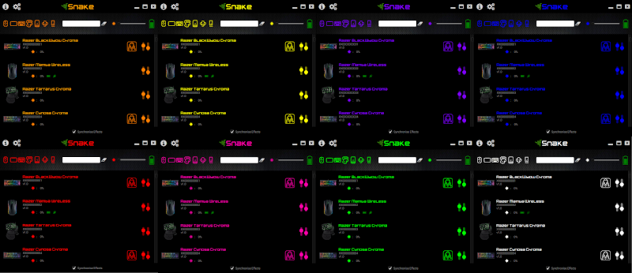

**Use Window Manager Decorations** - By default, Snake uses "Client Side Decorations", and draws it's own window title bar and window management buttons (close, min, max). Turn this option off to use window manager decorations instead. In this mode, Options and About are both insteads accessed from icons at the bottom right of the overview screen.

**Transparency** - If you are using client side decorations, then window transparency is possible. This slider sets how transparent the window should be.

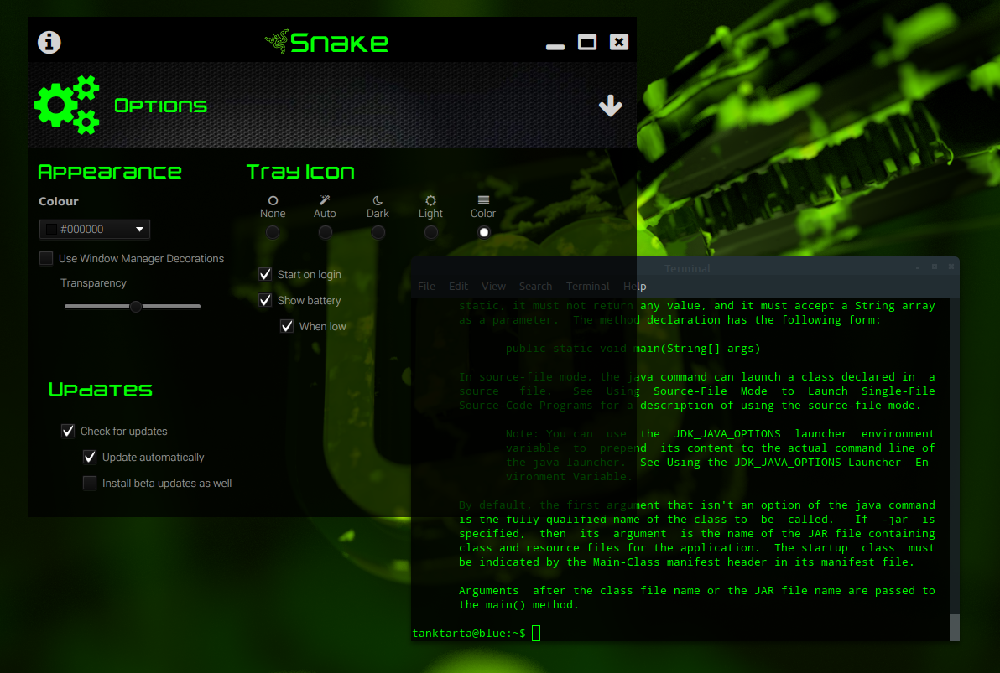

### Updates

**Check for updates** - Whether to check for updates at all. When deselected, neither automatic or manual updating is possible.

 **Update automatically** - When selected, Snake will update itself automatically on startup if required. 
 
 **Install beta updates as well** - When selected, you will be able to receive beta updates  that may contain fixes or features that you wish to try out before full release.

### Tray

**Icon  Style** - Different options for how the tray icon appears, if at all.

**Show Battery** - If you have at least one device that has a battery, then the option is given to show the battery status on the system tray instead of the razer logo.

  **When low** - When selected the battery status will only be showing if the overall battery status is *Low*.
  
**Start on login** - If the tray icon is enabled, you probably want to start it when you login. The option allows you to do so. When turned off, the tray icon will appear when you manually start Snake.

## System Tray

The system tray icon runs in the background and provides quick access to common functions of your devices.

 
 
 It can also show a summary of the battery status (when configuration).

## Device Overview

Device Overview is the first screen you see when opening Snake. It lists all of the supported Razer devices that the driver has discovered. 

If an expected device is not listed, please check if it works with other OpenRazer clients. If it does not, it is likely you want to direct any feature requests to the OpenRazer project.

If you have lots of devices, you can use the search and filter options to narrow down what is shown, although this is most useful when testing Snake with lots of 'Fake Drivers' that OpenRazer can supply.

Either double click anywhere on the row or click the Slider icon on the far right of each row to see the details for that device.

## Device Details

Double clicking on a device in the over page will show the configuration screen for that device.

It will show all of the supported *Controls*, depending on what device is in use.

 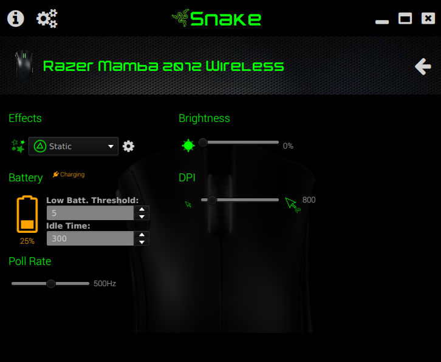

For example, controls are provided for :-

 * Brightness. Will allow configuration of both overall brightness, and per region brightness.
 * Effects. Choose and configure various standard Razer effects.
 * Poll Rate. Low level setting for mice.
 * DPI. Dots per inch setting, changes the accuracy of your mouse movements.
 * Battery. Shows battery status and allows configuration of low-battery thresholds.
 * Game Mode.  Turn game mode on or off. When on, the Windows key will be disabled.
 
 At any time, clicking on the *Back* icon at the top right of the screen will return you to the *Device Overview* screen.
 
### Brightness

Controls the intensity of  all lights in a region, or overall on the device. If the device only supports a single lighting region, only a single slider will be shown.

 
 
### Poll Rate

A low level setting that determines the speed at which your computer communicates with this device.

 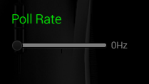
 
### DPI

Dots per inch setting, changes the accuracy of your mouse movements.

The maximum setting here can differ between devices. The higher the number, the faster the mouse pointer will move across the screen as you physically move the house. A lower number means the mouse pointer will move slower across the screen with more accuracy.

A value of 1000 to 2000 is probably comfortable for daily usage.

 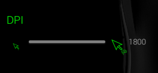
 
### Effects
 
Many devices are capable of multiple effects. Some of those effects have their own configuration, and often it is possible to configure different effects for each region.
 
#### None
 
 This effect type simply turns off all lighting. There is no further configuration.
 
#### Static

The simplest effect,  just sets a fixed colour either on the whole device or individual regions. 

 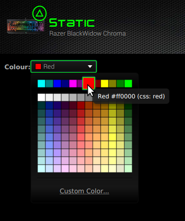
 
#### Wave

The region or device will show a multi-colours moving wave, in one of two directions. 

 
 
#### Spectrum

The region or device will cycle at a fixed speed through all colours. 

#### Reactive

The region or device will light up on key or button clicks or mouse wheel movement.

Configuration allows changing of the colour and sensitivity of these reactions.

 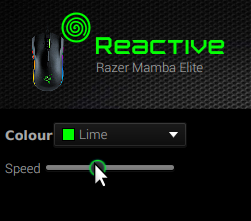

#### Breath

The region or device will gently pulsate different colours.

Configuration allows changing of the colours and a special random mode.

 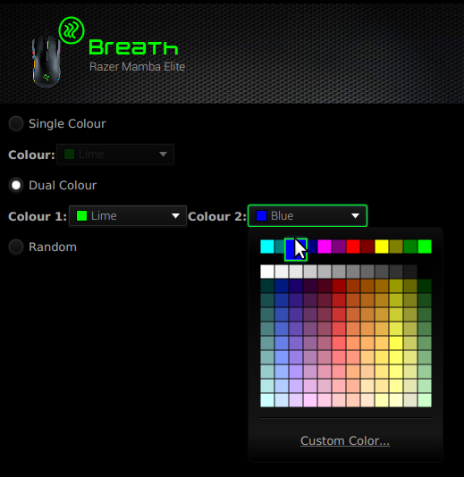

#### Ripple

The region or device will light a ripple effect moving outwards from the centre of the device, with either a random colour or a fixed single colour.

 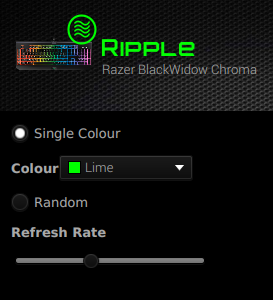

#### Pulsate

The region or device will gently pulsate a single fixed colour.

#### Starlight

The region or device will twinkle lights on and off using  either a random colour or a fixed single colour to mimick a night sky.

 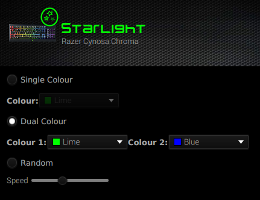
 
#### Matrix

The Matrix effect may only be set on the whole device, and allows each LED to be individually configured.

The exact layout of the screen will depend on the device. If it is a keyboard, a virtual keyboard will be shown, otherwise just a row of numbered LED lights will be seen.

 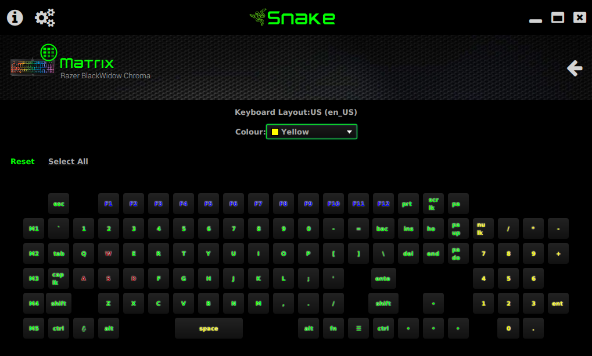

## Macros

The Macro UI is available, but due to coming changes in OpenRazer this is likely to radically change, so I won't go into any detail here.

 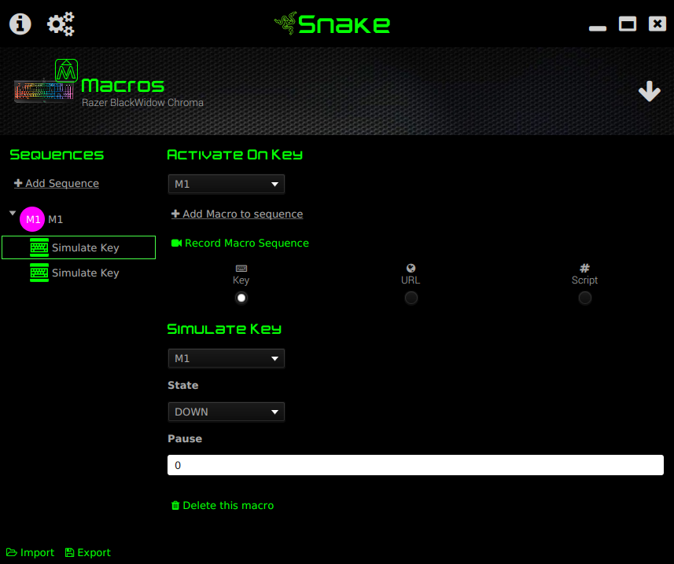

### Recording Macros

** Note, Recording functionality is not complete, but will be before final release. You can manually edit macros though.  **

 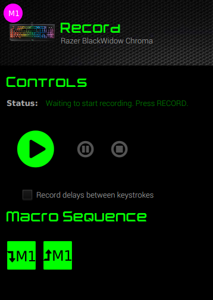
